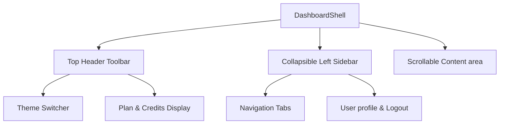

# CallingGen UI Design System & Component Specification

Welcome to the **CallingGen** Design System and Component Specification guide. This document serves as the single source of truth for the codebase's visual design, layout philosophy, color system, typography, custom utility classes, animations, and component styling conventions.

---

## 1. Visual Philosophy & Core Principles

CallingGen is a state-of-the-art AI-driven voice calling dashboard. The design matches its advanced intelligence with a premium, sleek, and highly interactive user experience.

- **Dark Mode First**: Optimized for long working hours with an elegant, modern dark theme utilizing deep violet/indigo accents.
- **Micro-Animations**: Smooth visual cues (floats, pulses, gradient shifts) represent the "live" intelligence of AI agents.
- **Glassmorphism**: Translucent backdrops (`backdrop-blur`) create layered depth in modals and layouts.
- **Aesthetic Rigor**: Uses precise OKLCH colors, rounded borders (`--radius`), high-contrast icons (from `lucide-react`), and clean margins.

---

## 2. Color System & Theme Variables

CallingGen leverages **Tailwind CSS v4**'s `@theme` directive, utilizing the **OKLCH** color space for bright, accurate, and harmonious rendering on modern displays.

### CSS Variables (Defined in [globals.css](file:///e:/Sai%20Sathwik/callinggen-ui/app/globals.css))

| Variable Name | Light Mode Value (OKLCH) | Dark Mode Value (OKLCH) | Purpose |
| :--- | :--- | :--- | :--- |
| `--background` | `0.985 0.002 270` | `0.13 0.015 270` | Main application background |
| `--foreground` | `0.15 0.01 270` | `0.95 0.005 270` | Primary text color |
| `--primary` | `0.55 0.24 265` | `0.65 0.24 265` | Accent buttons, active states, key focus |
| `--secondary` | `0.955 0.015 270` | `0.22 0.02 270` | Secondary buttons and pill tabs |
| `--muted-foreground`| `0.5 0.015 270` | `0.65 0.015 270` | Secondary texts, subtitles |
| `--card` | `1 0 0` | `0.18 0.015 270` | Card & panel background elements |
| `--border` | `0.91 0.01 270` | `0.28 0.015 270` | Layout borders & dividers |
| `--ring` | `0.55 0.24 265` | `0.65 0.24 265` | Keyboard focus ring color |
| `--sidebar` | `0.98 0.005 270` | `0.16 0.015 270` | Sidebar background |

---

## 3. Typography & Spacing

- **Primary Font**: `font-sans` (System-optimized sans-serif). Used for headings, body copy, and UI controls.
- **Monospace Font**: `font-mono` (Geist Mono). Used for IDs, data values, time stamps, durations, and phone numbers.
- **Font Sizes**:
  - Page Titles: `text-xl` or `text-2xl` bold.
  - Section Headers: `text-sm` font-semibold.
  - Subtitles / Metadata: `text-xs` or `text-[10px]` tracking-wide.

---

## 4. Custom CSS Utilities & Class References

Custom utilities are defined inside [globals.css](file:///e:/Sai%20Sathwik/callinggen-ui/app/globals.css) to support rich aesthetics:

### `.gradient-text`
Creates a flowing, animated linear gradient spanning Violet/Indigo/Pink hues. Used for hero texts and major brand headings.
```css
/* Usage example */
<h2 className="text-3xl font-bold">
  <span className="gradient-text">AI Report Generator</span>
</h2>
```

### `.glow-primary`
Applies a premium glow box-shadow to components using the primary theme color. Perfect for call-to-action buttons.
```css
/* Adds deep, high-end floating glow around primary accents */
.glow-primary {
  box-shadow: 0 0 20px oklch(0.55 0.24 265 / 0.3), 0 0 60px oklch(0.55 0.24 265 / 0.1);
}
```

### `.glass-card`
Implements glassmorphism backdrop-blur effects for cards, overlays, and floating status elements.
```html
<div className="glass-card p-6 rounded-xl">
  <!-- Content here -->
</div>
```

### `.animate-float`
Causes a element to hover gently up and down along the Y-axis.
```html
<div className="animate-float">
  <!-- Glowing icon, decorative vector or badge -->
</div>
```

### `.animate-pulse-glow`
Fades a primary-colored box shadow in and out recursively. Great for "Active Call" or "Recording" indicator lights.

### `.animate-fade-up`
Smooth entry animation that slides elements up 24px and fades them in on page render.
```html
<div className="animate-fade-up">
  <!-- Page content grid or lists -->
</div>
```

### `.animate-progress`
Provides a sliding horizontal gradient animation. Specifically used in page loaders or report generation indicator bars.

---

## 5. Layout & Shell Blueprint

All dashboard pages are wrapped by [DashboardShell.tsx](file:///e:/Sai%20Sathwik/callinggen-ui/components/DashboardShell.tsx). 



### Key Layout Features:
1. **Sidebar Toggle**: Standardized Menu icon triggers a slide-in sidebar on mobile view, backed by a dark translucent blur backdrop.
2. **Top Header Bar**: Holds quick actions, the User profile bubble, current workspace indicators (e.g., `Starter Plan` and the `Credits Display` which changes colors dynamically based on remaining credits), and a theme toggle.
3. **Credit Status Rule**: If credits < 100, display red badges (`bg-red-50 text-red-600 dark:bg-red-950/40 dark:text-red-400`); otherwise, display neutral grey.

---

## 6. UI Component Implementation Guidelines

### A. Metrics Grids
For standard key-value statistics, lay them out in a responsive grid (`grid grid-cols-2 gap-3 sm:grid-cols-4`).
- **Structure**:
  ```tsx
  <div className="rounded-xl border border-zinc-200 bg-white p-4 shadow-sm dark:border-zinc-800 dark:bg-zinc-900">
    <div className="flex items-start justify-between">
      <p className="text-xs text-zinc-500 dark:text-zinc-400">Metric Label</p>
      <div className="flex h-7 w-7 items-center justify-center rounded-lg bg-zinc-100 dark:bg-zinc-800">
        <Icon className="h-3.5 w-3.5 text-zinc-700 dark:text-zinc-300" />
      </div>
    </div>
    <p className="mt-2 text-2xl font-bold">124</p>
    <p className="mt-1 text-[10px] text-zinc-400 dark:text-zinc-500">+12% vs last week</p>
  </div>
  ```

### B. Data Tables
Tables should handle responsive horizontal overflow by wrapping with `overflow-x-auto` on parent nodes.
- Use `divide-y divide-zinc-100 dark:divide-zinc-800`.
- Table headers (`<th>`) must use `text-xs font-semibold uppercase tracking-wider text-zinc-500`.
- Cells (`<td>`) should apply hover transitions: `transition hover:bg-zinc-50 dark:hover:bg-zinc-800/50`.
- Numerical/ID cells should use Monospace (`font-mono text-xs`).

### C. Status Badges & Sentiment styling
Standard color-coded rules apply:
- **Hot / Completed / Positive / Active**: Emerald/Teal tones (`bg-emerald-100 text-emerald-700 dark:bg-emerald-900/30 dark:text-emerald-400`).
- **Warm / Callback / Pending / Paused**: Amber/Orange tones (`bg-amber-100 text-amber-700 dark:bg-amber-900/30 dark:text-amber-400`).
- **Cold / Failed / No Answer**: Red/Rose tones (`bg-red-100 text-red-700 dark:bg-red-900/30 dark:text-red-400`) or Grey tones (`bg-zinc-100 text-zinc-600 dark:bg-zinc-800 dark:text-zinc-400`).
- **New / Draft**: Violet/Indigo accents (`bg-violet-100 text-violet-700 dark:bg-violet-900/30 dark:text-violet-400`).

---

## 7. Developer Coding Checklist

When writing new features, pages, or elements:
1. Ensure full accessibility by adding `aria-label` or matching IDs.
2. Use **semantic HTML5 elements** (`main`, `aside`, `nav`, `header`, `section`, `table`).
3. Keep layout responsiveness in mind (test grid structures at standard breakpoints: `sm`, `md`, `lg`, `xl`).
4. Avoid plain grey overlays or simple red/blue alerts. Lean into CallingGen's custom CSS properties (`.glass-card`, `.gradient-text`, and theme tokens).
5. Always test layouts under both light and dark classes.
